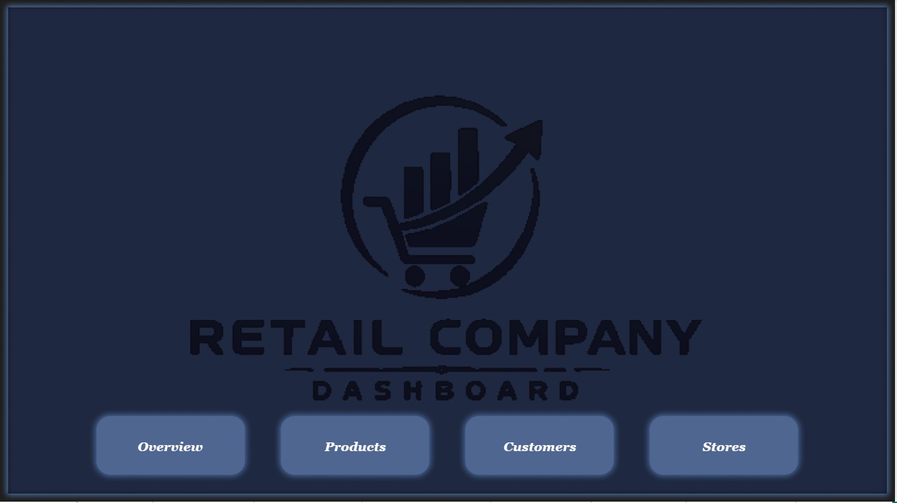
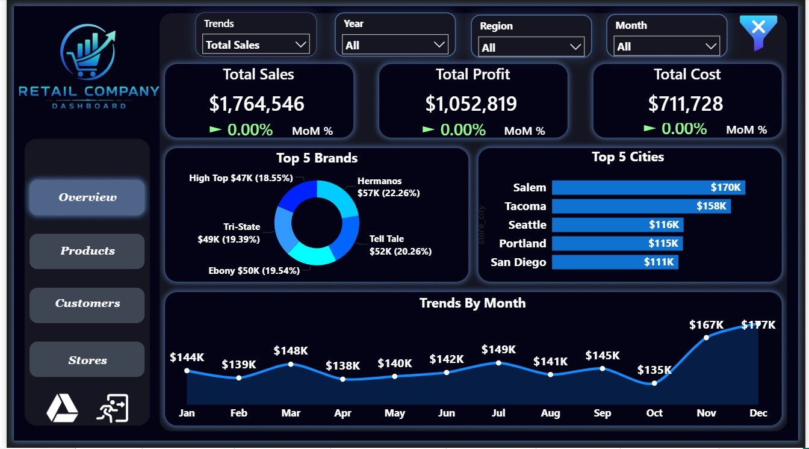
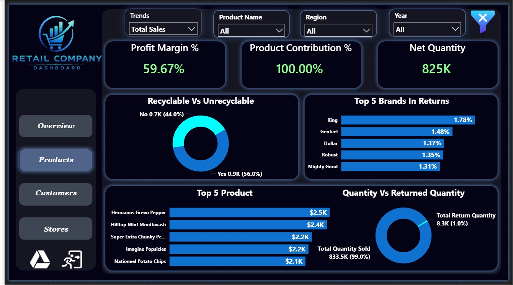
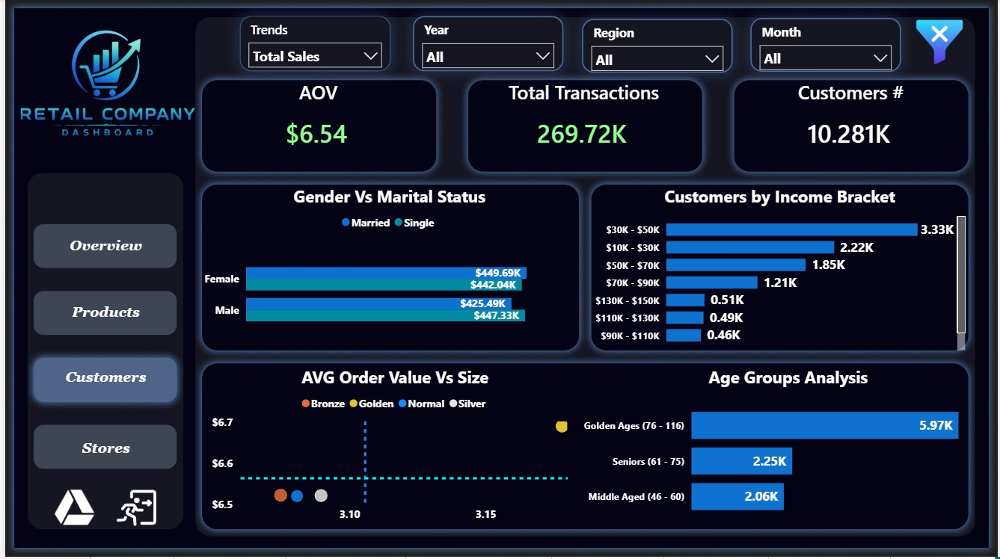
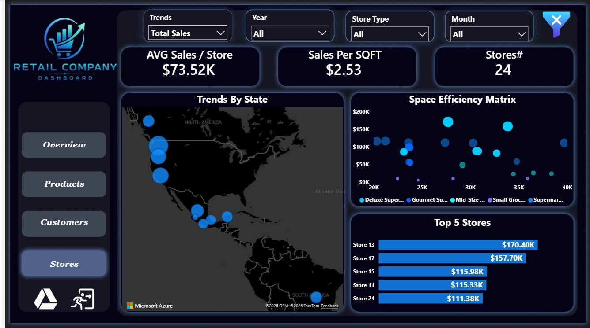

# 🛒 Retail Company Dashboard

## 📌 Project Overview
A comprehensive retail company dashboard built using SQL and Power BI, analyzing sales performance,
product profitability, customer segments, and store efficiency across multiple regions in North America.

## 🎯 Objectives
- Analyze total sales, profit, and cost trends across months and regions
- Identify top-performing products, brands, and stores
- Segment customers by income bracket, age group, and spending behavior
- Evaluate store space efficiency and geographic sales distribution

## 🛠️ Tools & Technologies
| Tool | Purpose |
|------|---------|
| SQL | Data Extraction & Querying |
| Power BI | Data Visualization & Dashboard |
| Figma | Dashboard UI Design & Prototyping |

## 📊 Key Findings
- **Total Sales: $1,764,546** with a profit of **$1,052,819**
- **Salem** is the top city by sales with **$170K**
- **Hermanos** is the top brand with **22.26%** market share
- **Store 13** is the best performing store with **$170.40K** in sales
- **10,281 customers** with an Average Order Value of **$6.54**
- Largest customer segment: **Golden Ages (76-116)** with **5.97K** customers

## 📸 Dashboard Preview

### 🏠 Home Page

### 📈 Overview Page

### 📦 Products Page

### 👥 Customers Page

### 🏪 Stores Page

## 👤 Author
**Ramez Reda** — Data Analyst

